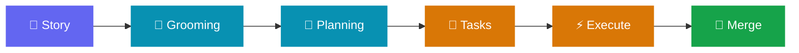
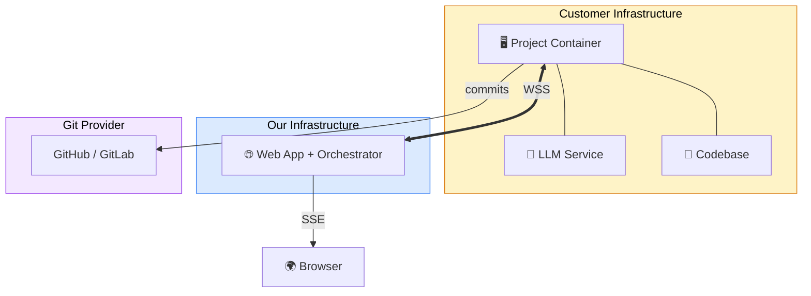

<p align="center">
  <a href="#">
    
  </a>
</p>

<p align="center">
  <strong>Developer owns every decision — AI owns the execution.</strong><br/>
  Not vibe-coding. Not manual coding. Structured ownership at AI speed.
</p>

<p align="center">
  <a href="#"></a>
  <a href="#"></a>
  <a href="#"></a>
  <a href="#"></a>
</p>

<p align="center">
  <a href="doc/spec.md">Spec</a> ·
  <a href="doc/tech.md">Architecture</a> ·
  <a href="doc/atomic_design.md">Design System</a>
</p>

---

## Why This Exists

Current AI-assisted development is fragmented. Developers pick a task on Jira, switch to Claude/Cursor, make decisions that nobody tracks, and paste results back. Decisions are lost. Context is lost. There's no traceability from requirement to code.

**tompa** replaces traditional project management tools with a native interface where AI-driven workflows are first-class citizens — not bolted-on features.

<table>
<tr>
<td width="33%">

### Speed
AI pipeline runs autonomously, pauses only when human input is needed. Zero context-switching.

</td>
<td width="33%">

### Quality
Every decision point is explicitly answered before code is written. AI never guesses on ambiguous requirements.

</td>
<td width="33%">

### Transparency
Every line of code traces to a tracked decision. Reviewers see the full decision trail alongside the diff.

</td>
</tr>
</table>

---

## How It Works

```
Human creates story → AI expands → Grooming Q&A → Planning Q&A → Task Decomposition → Execution → MR
```



1. **Create** — Human writes a brief story description; AI expands it using knowledge base + codebase context
2. **Groom** — AI asks multi-role requirement questions (Business, UX, Marketing, Dev, Security) with predefined answers
3. **Plan** — AI asks technical architecture questions (database, API, error handling)
4. **Decompose** — AI proposes tasks; human can merge, split, or reorder
5. **Execute** — For each task: deep-dive Q&A → Claude Code implements → human reviews → commit
6. **Ship** — AI runs tests, generates MR with full decision trail

> **The "Never Guess, Always Ask" Principle** — When the AI encounters ambiguity, it pauses and sends a structured question to the UI. The developer answers. The agent resumes.

---

## Architecture



**Critical design constraint:** Customer code never reaches our server. Only Q&A results transit through. All LLM calls and code generation happen on customer infrastructure using the customer's own API key.

### Container Modes

| Mode | Use Case | Services |
|------|----------|----------|
| `project` | Shared team container (24/7) | Story Q&A, task decomposition, setup UI |
| `dev` | Per-developer container | Task Q&A, Claude Code execution, git ops |
| `standalone` | Solo developer | All services merged |

---

## Tech Stack

<table>
<tr>
<td valign="top" width="50%">

### Backend
| | |
|-|-|
| Language | **Rust** |
| Framework | Axum |
| Database | PostgreSQL + sqlx |
| API Docs | utoipa → OpenAPI 3.1 |
| Real-time | WebSocket + SSE |
| Agent | Actor model (tokio + mpsc) |

</td>
<td valign="top" width="50%">

### Frontend
| | |
|-|-|
| Framework | **React 18** |
| Build | Vite + Bun |
| Components | shadcn/ui (Radix) |
| State | TanStack Query + Zustand |
| Routing | TanStack Router |
| API Client | Auto-generated via Orval |

</td>
</tr>
</table>

### Type Pipeline

```
Rust structs → utoipa → OpenAPI 3.1 → Orval → TypeScript types + TanStack Query hooks
```

CI enforces sync — if generated TypeScript files differ from committed files, the build fails.

---

## Repository Structure

```
tompa/
├── backend/
│   ├── server/          # Web API — Rust / Axum
│   ├── agent/           # Container agent — Rust / Tokio actors
│   └── shared/          # Shared types — WS schemas, enums
├── frontend/            # React SPA — Vite + Bun + shadcn/ui
├── helm/                # Kubernetes Helm chart
├── doc/                 # Specs & architecture docs
├── .github/workflows/   # CI/CD pipelines
└── Cargo.toml           # Workspace root
```

---

## Key Design Decisions

| Decision | Choice | Why |
|----------|--------|-----|
| Own web app vs. plugin | Custom web app | AI-native UX, full control over Q&A workflow |
| Code stays on customer infra | Container agents | Enterprise trust — code never leaves |
| Structured Q&A vs. chat | Predefined answers | Traceable decisions, not chat transcripts |
| Rust backend + agent | Shared types crate | Single source of truth, type safety |
| WebSocket for agents | Bidirectional JSON | Real-time with auto-reconnect |
| SSE for browser | Query invalidation | Single data path via TanStack Query |
| Actor model | tokio + mpsc | Isolated state, clean concurrency |
| Single Docker image | `MODE` env flag | One artifact, three deployment modes |

---

## Documentation

| Document | Description |
|----------|-------------|
| [`doc/spec.md`](doc/spec.md) | Product specification and feature requirements |
| [`doc/tech.md`](doc/tech.md) | 65 architecture decisions with rationale |
| [`doc/atomic_design.md`](doc/atomic_design.md) | Component design system and interaction patterns |

---

## Target Users

- **Primary:** Startup teams (1–5 people), CTO/Tech Lead as buyer
- **Requirement:** Each team member has a Claude Code license
- **Deployment:** Self-hosted containers (customer infra) + hosted web app (our infra)

---

<p align="center">
  <sub>🚧 In active development · Proprietary — All rights reserved</sub>
</p>
