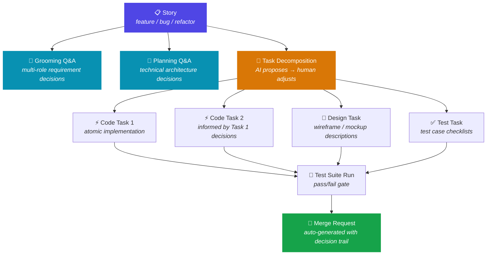
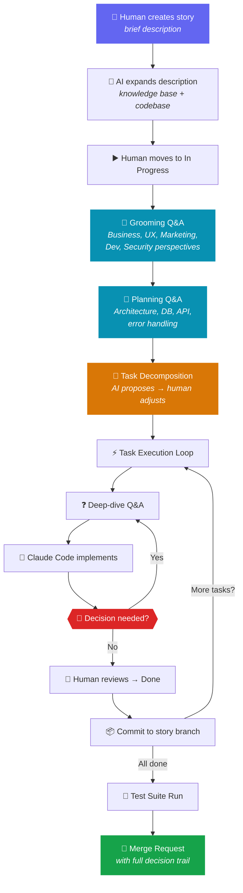
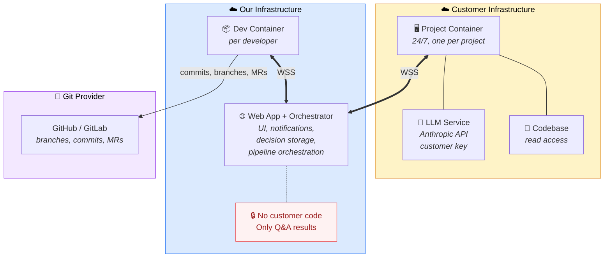
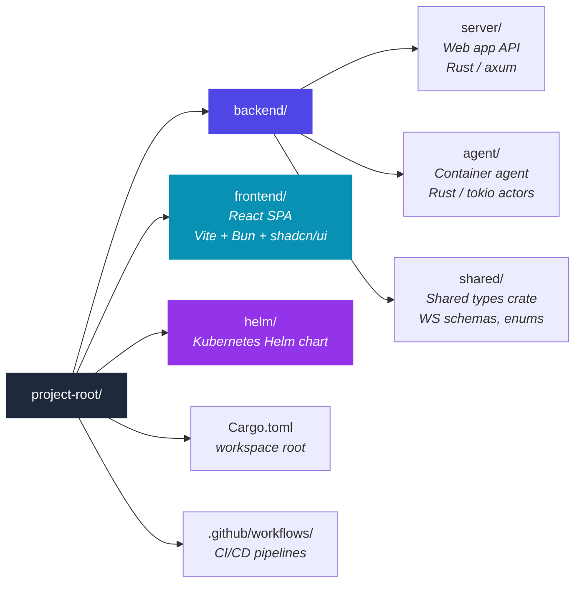
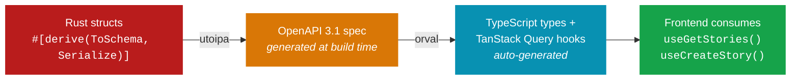
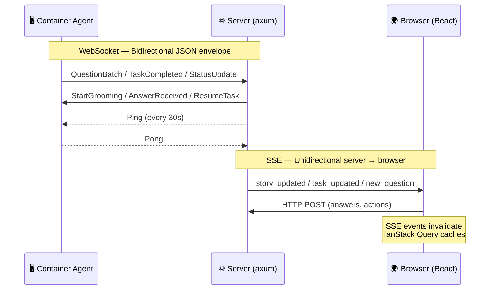
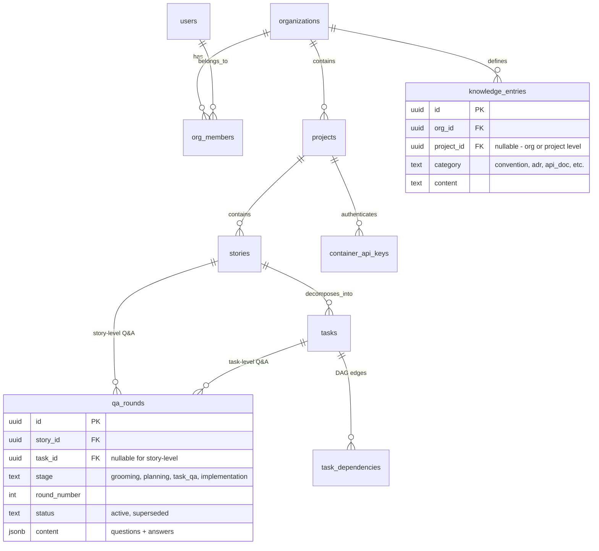
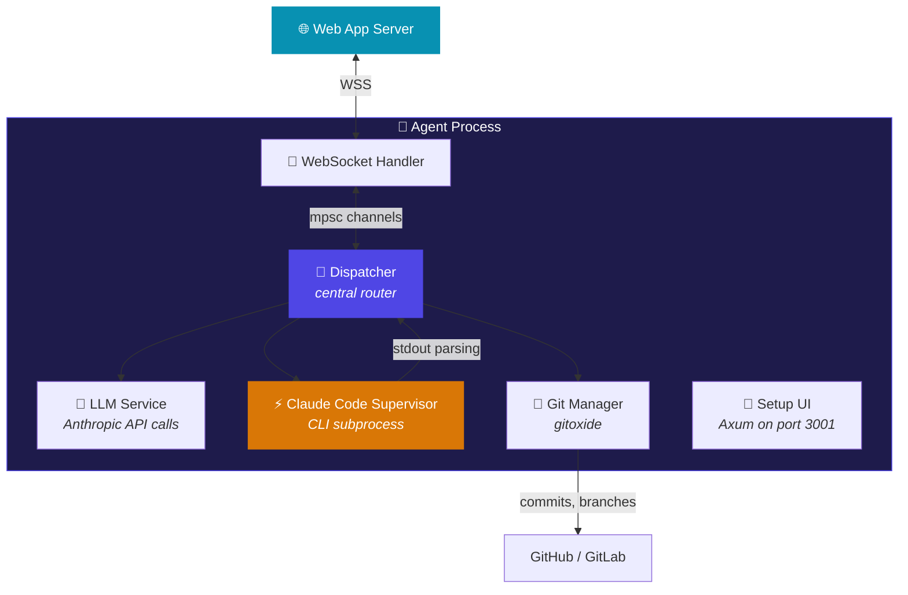
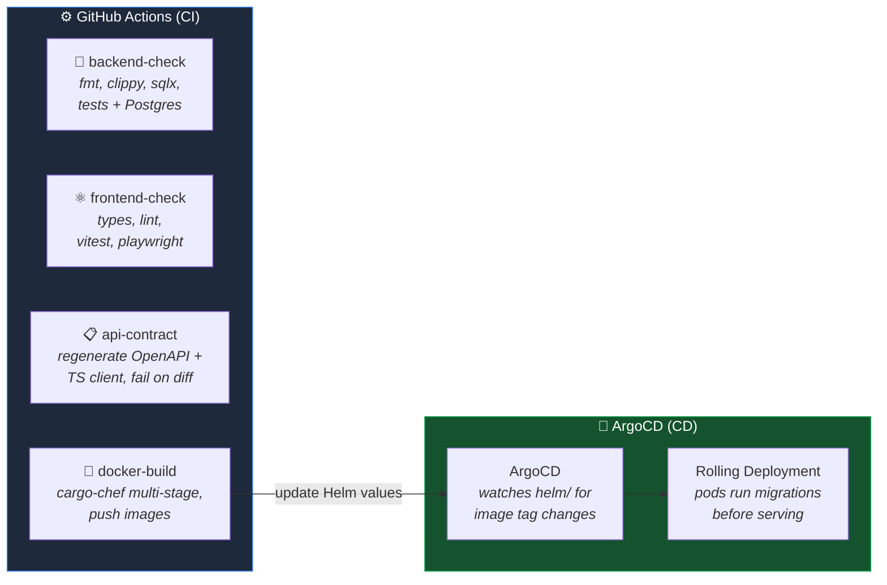

# AI-Integrated Development Pipeline

> **"Developer owns every decision — AI owns the execution."**
>
> Not vibe-coding. Not manual coding. Structured ownership at AI speed.

A purpose-built web application that deeply integrates AI into the software development lifecycle. It replaces traditional project management tools (Jira, Linear) with a native interface where AI-driven workflows are first-class citizens — not bolted-on features.

The core loop: **humans make decisions** by selecting from AI-generated options. **AI executes** based on those decisions. AI never guesses — it always asks.

---

## Why This Exists

Current AI-assisted development is fragmented. Developers pick a task on Jira, switch to Claude/Cursor, make decisions that nobody tracks, and paste results back. Decisions are lost. Context is lost. There's no traceability from requirement to code.

This product solves three problems equally:

- **Speed** — AI pipeline runs autonomously, pauses only when human input is needed. Zero context-switching.
- **Quality** — Every decision point is explicitly answered before code is written. AI never guesses on ambiguous requirements.
- **Transparency** — Every line of code traces to a tracked decision. Reviewers see the full decision trail alongside the diff.

---

## How It Works

### Work Hierarchy



**Stories** represent features or user stories. Each owns a single Merge Request and a dedicated git worktree for parallel implementation.

**Tasks** are the smallest unit AI can implement in one session (3–5 story points, ~10–15 file changes). They are auto-generated by AI after story-level grooming and planning, then reviewed and adjusted by humans.

### Pipeline Flow



1. Human creates a story with a brief description → AI expands it using knowledge base + codebase context
2. Human moves story to "In Progress" → AI pipeline triggers
3. **Grooming** — AI asks multi-role requirement questions (Business, UX, Marketing, Dev, Security) with predefined answers
4. **Planning** — AI asks technical architecture questions (database, API, error handling)
5. **Task Decomposition** — AI proposes tasks; human can merge, split, or reorder
6. **Task Execution** — For each task: deep-dive Q&A → Claude Code implements → human reviews and marks Done → commit
7. **Test & MR** — AI runs test suite, generates MR description with decision trail links

At every stage, AI presents structured questions with predefined answers. Humans select. "Other" free-form is the escape hatch, not the default.

### The "Never Guess, Always Ask" Principle

When the AI agent encounters ambiguity during implementation, it **pauses execution** and sends a structured question back to the web app. The developer answers in the UI. The agent resumes. This replaces the traditional pattern of AI making assumptions that lead to wasted rework cycles.

---

## Architecture



**Critical design constraint:** Customer code never reaches our server. Only Q&A results (questions + selected answers) transit through. All LLM calls and code generation happen inside containers running on customer infrastructure using the customer's own Anthropic API key.

### Container Modes

A single Docker image supports three modes via `MODE` environment variable:

| Mode | Use Case | Services |
|------|----------|----------|
| `project` | Shared team container (24/7) | Story Q&A, task decomposition, setup UI |
| `dev` | Per-developer container | Task Q&A, Claude Code execution, git operations |
| `standalone` | Solo developer | All services merged into one container |

---

## Tech Stack

### Frontend

| Component | Technology |
|-----------|------------|
| Framework | React 18+ |
| Build | Vite + Bun |
| UI Components | shadcn/ui (Radix primitives) |
| Server State | TanStack Query |
| UI State | Zustand |
| Routing | TanStack Router (type-safe) |
| Drag-and-Drop | @dnd-kit |
| API Client | Auto-generated via orval from OpenAPI spec |
| Real-time | SSE (server → browser) via native EventSource |
| Testing | Vitest + Playwright |

### Backend (Web App Server)

| Component | Technology |
|-----------|------------|
| Language | Rust |
| Async Runtime | tokio |
| HTTP Framework | axum |
| Database Driver | sqlx (compile-time checked queries) |
| Error Handling | thiserror (domain) + anyhow (infrastructure) |
| API Docs | utoipa (OpenAPI generation) |
| WebSocket | axum built-in |
| Connection Registry | DashMap (trait-backed for future Redis swap) |

### Container Agent

| Component | Technology |
|-----------|------------|
| Language | Rust (shared monorepo crate) |
| Architecture | Actor model (tokio tasks + mpsc channels) |
| AI Execution | Claude Code CLI subprocess with session persistence |
| Git | gitoxide (Rust-native) |
| Setup UI | Embedded Axum server + bundled React SPA |
| LLM Calls | Anthropic API (customer's key) |

### Database

| Component | Technology |
|-----------|------------|
| DBMS | PostgreSQL |
| IDs | UUIDv7 (time-ordered) |
| Multi-tenancy | `org_id` column scoping + Row-Level Security |
| Migrations | sqlx embedded, run at startup |

### Infrastructure

| Component | Technology |
|-----------|------------|
| Orchestration | k3s (Kubernetes) |
| CD | ArgoCD (GitOps) |
| Secrets | OpenBao + External Secrets Operator |
| Ingress | Nginx |
| DNS | Cloudflare |
| CI | GitHub Actions |
| Docker Build | Multi-stage with cargo-chef |

---

## Repository Structure



The three Rust crates (`server`, `agent`, `shared`) form a Cargo workspace. The `shared` crate contains WebSocket message schemas and serialization types consumed by both `server` and `agent`, ensuring a single source of truth for the communication protocol.

---

## API Design

REST with flat URLs versioned under `/api/v1/`. Full type pipeline from backend to frontend:



CI enforces sync — if generated TypeScript files differ from committed files, the build fails.

### Key Endpoints

```
# Auth
GET  /api/v1/auth/login/:provider       → OAuth2 redirect (Google / GitHub)
GET  /api/v1/auth/callback/:provider    → Callback, set JWT cookie
GET  /api/v1/auth/me                    → Current user + org

# Stories & Tasks
GET    /api/v1/stories?project_id=X     → List (ordered by rank)
POST   /api/v1/stories/:id/start        → Trigger AI pipeline
GET    /api/v1/tasks?story_id=X         → List tasks for story
POST   /api/v1/tasks/:id/done           → Human sign-off

# Q&A
GET    /api/v1/qa-rounds?story_id=X     → Story-level Q&A rounds
POST   /api/v1/qa-rounds/:id/answer     → Submit answer
POST   /api/v1/qa-rounds/:id/rollback   → Checkpoint rollback

# Real-time
GET    /api/v1/events/stream            → SSE (story/task updates, new questions)
WS     /ws/container                    → Agent ↔ Server (bidirectional)
```

---

## Real-time Communication

Two channels handle all real-time coordination:



**WebSocket** (Server ↔ Container Agent) — Typed Rust enums in the shared crate. Carries commands and events. Heartbeat ping/pong every 30s with auto-reconnect on disconnect.

**SSE** (Server → Browser) — Event stream per authenticated user. Events trigger TanStack Query cache invalidation — single data path.

---

## Authentication & Security

- **Users:** OAuth2 only (Google + GitHub). No password infrastructure. JWT in HTTP-only secure cookies.
- **Containers:** API key per container, server-generated, bcrypt-hashed in DB. Sent in WebSocket handshake `Authorization` header.
- **Multi-tenancy:** Shared PostgreSQL database with `org_id` on every tenant-scoped table. Dual enforcement via application middleware (compile-time mandatory `org_id` parameters) and Postgres Row-Level Security policies.
- **Rate Limiting:** Nginx ingress level (sufficient for early stage).
- **CORS:** Same origin in production (API under subpath). Vite proxy in development.

---

## Database Design

Core principles: UUIDv7 for all primary keys (time-ordered for index performance), soft delete via `deleted_at` timestamp, compile-time checked queries via `sqlx::query!`, and embedded migrations run at startup.



Q&A data uses a hybrid design: relational columns for queryable metadata (`story_id`, `stage`, `round_number`, `status`) with JSONB for flexible question/answer content.

---

## Agent Architecture

The container agent uses an actor model with isolated tokio tasks communicating via typed `mpsc` channels:



**Claude Code integration:** The agent invokes Claude Code via CLI subprocess with session flags. When a decision point is detected (via stdout parsing), the agent pauses execution, sends a structured question to the server, waits for the human answer, then resumes with `--session-id X --resume`. A future upgrade path to MCP `ask_human` tool is planned if output parsing proves fragile.

**System prompts** are template-based with variable injection from the hierarchical knowledge base (`{{org_conventions}}`, `{{project_patterns}}`, `{{story_decisions}}`, `{{codebase_context}}`).

---

## CI/CD Pipeline



Docker builds use cargo-chef for cached dependency layers — only application code changes trigger a full rebuild.

---

## Testing Strategy

| Layer | Tool | Scope |
|-------|------|-------|
| Backend unit | Cargo test | Service logic, state machines, DAG validation |
| Backend integration | Cargo test + Postgres | Full CRUD, RLS enforcement, Q&A flows |
| Frontend unit | Vitest + MSW | Components, hooks, store behavior |
| Frontend E2E | Playwright | OAuth flow, Q&A interaction, drag-and-drop |
| Agent integration | Cargo test + mocks | WebSocket mock server, mock Anthropic API, mock CLI output |
| API contract | CI diff check | OpenAPI spec + TypeScript client sync |

---

## Key Design Decisions

| Decision | Choice | Why |
|----------|--------|-----|
| Own web app vs. Jira plugin | Custom web app | AI-native UX, full control over Q&A workflow |
| Code stays on customer infra | Container agents | Enterprise trust — proprietary code never leaves |
| Structured Q&A vs. chat | Predefined answers | Traceable decisions, not chat transcripts |
| Rust for backend + agent | Shared types crate | Single source of truth for protocol, type safety |
| WebSocket for agents | Bidirectional JSON | Simplest real-time communication with auto-reconnect |
| SSE for browser | Query invalidation | Unidirectional signal, single data path via TanStack Query |
| Actor model for agent | tokio + mpsc | Isolated state, clean concurrent execution |
| Single Docker image | MODE env flag | One artifact, three deployment modes |
| Fractional indexing | lexorank | O(1) story reorder, no bulk updates |
| Soft delete everywhere | `deleted_at` | Full audit trail, recoverable |

---

## Target Users

- **Primary:** Startup teams (1–5 people), CTO/Tech Lead as buyer
- **Requirement:** Each team member has a Claude Code license
- **Use cases:** Web apps, mobile apps, APIs, internal tools
- **Deployment:** Self-hosted containers (customer infra) + hosted web app (our infra)

---

## Project Status

🚧 **In active development.** Core architecture decisions are finalized. Implementation is broken into parallelizable tasks across backend, frontend, and agent layers.

---

## Documentation

| Document | Description |
|----------|-------------|
| `product-feature-spec.md` | Complete product specification and feature requirements |
| `technical-decisions.md` | All 65 architecture decisions with rationale |
| `ui-ux-atomic-design-requirements.md` | Component design system and interaction patterns |
| `implementation-tasks.md` | Parallelizable task breakdown for development |

---

## License

Proprietary. All rights reserved.