# Cross-Story Intelligence — Feature Specification

> **Goal:** Eliminate redundant questions, prevent decision drift, and give the agent a holistic
> understanding of each project — all with minimal additional LLM cost.
>
> **Principles:**
> - Compress at write time, filter at read time, evolve continuously
> - Zero additional LLM calls in the Q&A hot path
> - Fully automatic — user can view and edit, but never has to
> - Profile is a knowledge source, not a behavior controller — agent config stays in user's hands

---

## 1. Problem Statement

The Q&A pipeline is story-isolated. Every story starts from scratch with no memory of what
the team decided before. This causes three concrete problems:

1. **Redundant questions** — The LLM re-asks "sync or async?" on every story that touches
   data pipelines, even though the team answered this 5 stories ago.
2. **Decision drift** — Story A picks REST, Story B picks GraphQL for the same concern,
   because neither sees the other's decisions.
3. **No project identity** — The agent has individual knowledge entries and Q&A decisions,
   but no synthesized understanding of what the project *is* — its tech stack, architectural
   patterns, and conventions as a coherent whole.

### 1.1 What This Feature Adds

Two complementary systems that build on the existing `knowledge_entries` and `qa_rounds` tables:

| System | What It Does | Granularity |
|--------|-------------|-------------|
| **Decision Distillation Pipeline** | Auto-extracts reusable decision patterns from Q&A answers, deduplicates, retrieves relevant ones per story | Per-decision rules |
| **Project Intelligence Profile** | Periodically synthesizes all patterns + knowledge into a structured project identity document | Holistic project view |

Together with the existing `knowledge_entries` (manual, per-document), these form three layers
of project intelligence at increasing levels of abstraction.

### 1.2 What This Feature Does NOT Do

- Does **not** automatically adjust question count, convergence thresholds, or prompt style.
  Those remain under user control via the existing manual agent configuration (model, detail
  level, max questions).
- Does **not** require approval gates or human-in-the-loop for pattern storage or profile
  generation. Everything is automatic. Users can view and edit when they want.

---

## 2. Three-Layer Knowledge Architecture

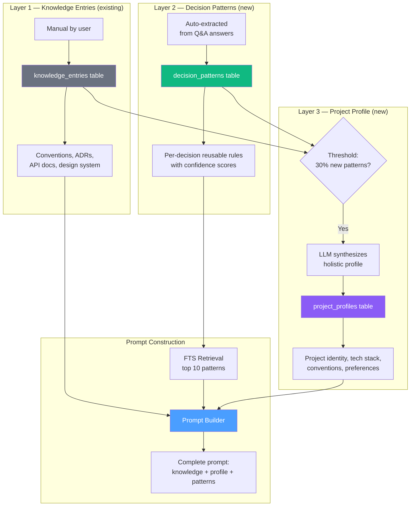

| Layer | Source | Table | Updated | Granularity | LLM Cost |
|-------|--------|-------|---------|-------------|----------|
| 1 | User (manual) | `knowledge_entries` | On user action | Individual docs | None |
| 2 | Auto (Q&A pipeline) | `decision_patterns` | Per Q&A round | Per-decision rules | 0 extra (piggybacked) |
| 3 | Auto (threshold) | `project_profiles` | Per threshold trigger | Holistic project | 1 call per trigger |

---

## 3. Decision Distillation Pipeline

### 3.1 High-Level Flow

```mermaid
graph TB
    subgraph "Write Path (Post Q&A)"
        A[Q&A Round Completed] --> B[Convergence Assessment<br/>+ Piggyback Distillation]
        B --> C{Patterns Extracted?}
        C -->|Yes| D[pg_trgm Dedup Check<br/>SQL only — no LLM]
        C -->|No| E[No patterns this round]
        D --> F{Classification}
        F -->|DUPLICATE| G[Skip Insert]
        F -->|REINFORCES| H[Bump Confidence<br/>of Existing Pattern]
        F -->|NEW| I[Insert into<br/>decision_patterns]
        F -->|CONTRADICTS| J[Flag for<br/>Human Review]
    end

    subgraph "Read Path (Pre Q&A Generation)"
        K[New Q&A Round Triggered] --> L[FTS + Tag Query<br/>SQL only — no LLM]
        L --> M[Top 10 Relevant Patterns]
        M --> N[Inject into Prompt as<br/>Established Project Patterns]
        N --> O[LLM Generates Questions<br/>Skipping Covered Decisions]
    end

    subgraph "Feedback Loop (Post Answer)"
        P[User Submits Answer] --> Q{Answer Aligns<br/>with Pattern?}
        Q -->|Yes| R[usage_count++]
        Q -->|No| S[override_count++]
        S --> T{override_count > 3<br/>in recent stories?}
        T -->|Yes| U[Flag for Review /<br/>Supersede]
        T -->|No| V[Recalculate Confidence]
        R --> V
    end

    style A fill:#4a9eff,color:#fff
    style K fill:#4a9eff,color:#fff
    style P fill:#4a9eff,color:#fff
    style B fill:#10b981,color:#fff
    style D fill:#10b981,color:#fff
    style L fill:#10b981,color:#fff
    style J fill:#f59e0b,color:#fff
    style U fill:#f59e0b,color:#fff
```

### 3.2 Write Path — Piggyback on Convergence Call

No new LLM call. The existing convergence assessment prompt is extended to extract patterns
simultaneously. This is the key cost optimization — distillation is free.

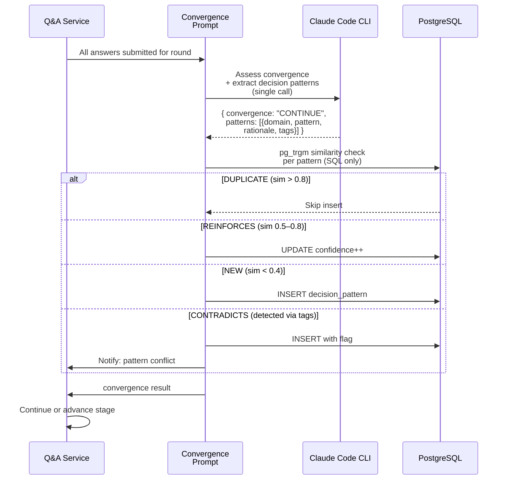

#### Extended Convergence Prompt

```
Assess whether you have sufficient information to proceed.
Additionally, extract 0–3 reusable decision patterns from
this round's answers — abstract principles that would apply
to future stories with similar concerns.

Respond ONLY with valid JSON:
{
  "convergence": "CONTINUE" | "SUFFICIENT",
  "patterns": [
    {
      "domain": "development|security|design|business|marketing",
      "pattern": "One-sentence reusable rule",
      "rationale": "Why this was decided",
      "tags": ["tag1", "tag2"]
    }
  ]
}
```

### 3.3 Dedup — PostgreSQL Only (No LLM)

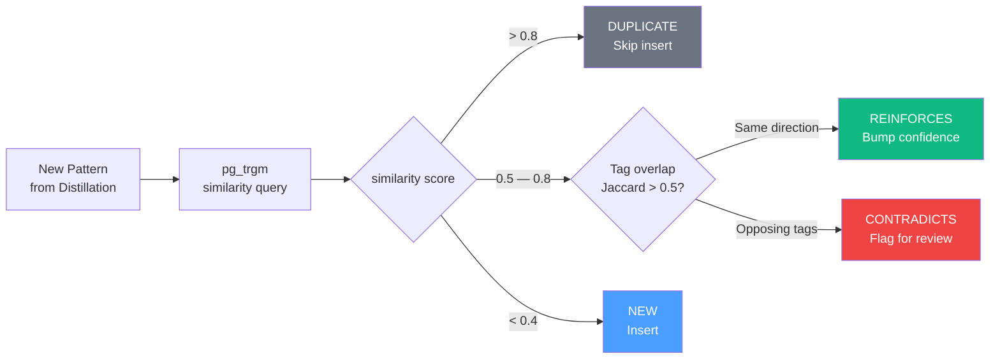

#### Trigram Similarity Search

```sql
SELECT id, pattern, confidence,
       similarity(pattern, $1) AS sim
FROM decision_patterns
WHERE org_id = $2
  AND (project_id IS NULL OR project_id = $3)
  AND domain = $4
  AND superseded_by IS NULL
  AND deleted_at IS NULL
  AND similarity(pattern, $1) > 0.4
ORDER BY sim DESC
LIMIT 5;
```

#### Tag Overlap (Jaccard)

```sql
SELECT id,
  array_length(tags & $1::text[], 1)::float /
  NULLIF(array_length(tags | $1::text[], 1), 0) AS tag_jaccard
FROM decision_patterns
WHERE org_id = $2 AND domain = $3
  AND superseded_by IS NULL AND deleted_at IS NULL;
```

#### Classification Logic (Rust, ~30 lines)

- `sim > 0.8` → DUPLICATE → skip insert
- `sim > 0.5` AND `tag_jaccard > 0.5` AND same semantic direction → REINFORCES → bump confidence
- `sim > 0.5` AND contradictory tag signal → CONTRADICTS → flag for human review
- `sim < 0.4` → NEW → insert

### 3.4 Read Path — FTS Pattern Retrieval (No LLM)

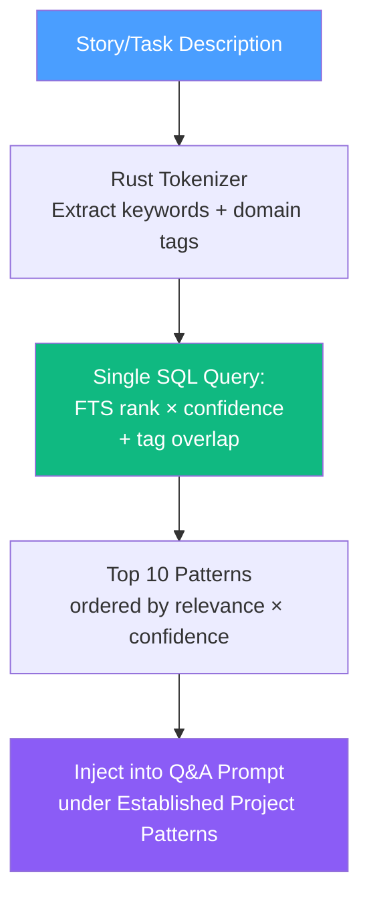

#### Retrieval Query

```sql
SELECT *,
  ts_rank(search_vector,
    websearch_to_tsquery('english', $1)) AS relevance,
  confidence
FROM decision_patterns
WHERE org_id = $2
  AND (project_id IS NULL OR project_id = $3)
  AND superseded_by IS NULL
  AND deleted_at IS NULL
  AND confidence > 0.5
  AND (
    search_vector @@ websearch_to_tsquery('english', $1)
    OR tags && $4::text[]
  )
ORDER BY relevance * confidence DESC
LIMIT 10;
```

#### Prompt Injection Format

```
## Established Project Patterns
These patterns were established by prior decisions in this project.
Use them as defaults unless the story requirements clearly conflict.
If a pattern covers a question you'd normally ask, skip it or
propose it as the recommended default instead of asking.

1. [development] Prefer async event-driven processing for data
   pipelines (confidence: 92%)
2. [security] All user-facing APIs require rate limiting at
   gateway level (confidence: 88%)
3. [design] Use card-based layouts for list views, table for
   admin views (confidence: 75%)
```

### 3.5 Feedback Loop — Confidence Evolution

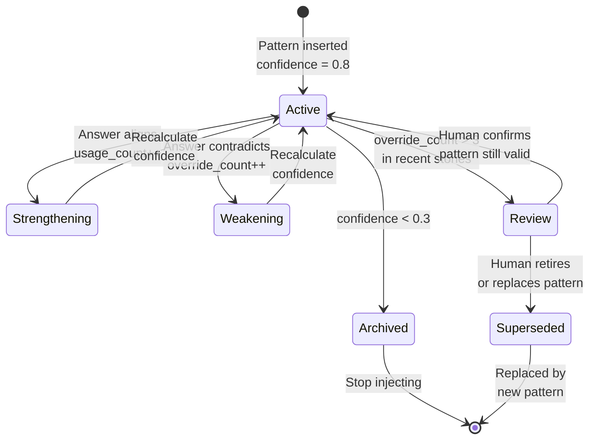

#### Confidence Formula

```
confidence = base_confidence × (usage_count / (usage_count + override_count × 2))
```

- `confidence < 0.3` → **archive** (stop injecting into prompts)
- `override_count > 3` in recent stories → **flag for human review**
- On supersede: set `superseded_by` FK, archived pattern stops appearing

### 3.6 Escape Hatch — LLM Relevance Scoring

If FTS retrieval quality degrades after 200+ patterns, add one lightweight LLM call before
prompt construction. This is the **only** scenario where an additional LLM call enters the
hot path, gated behind a configurable threshold.

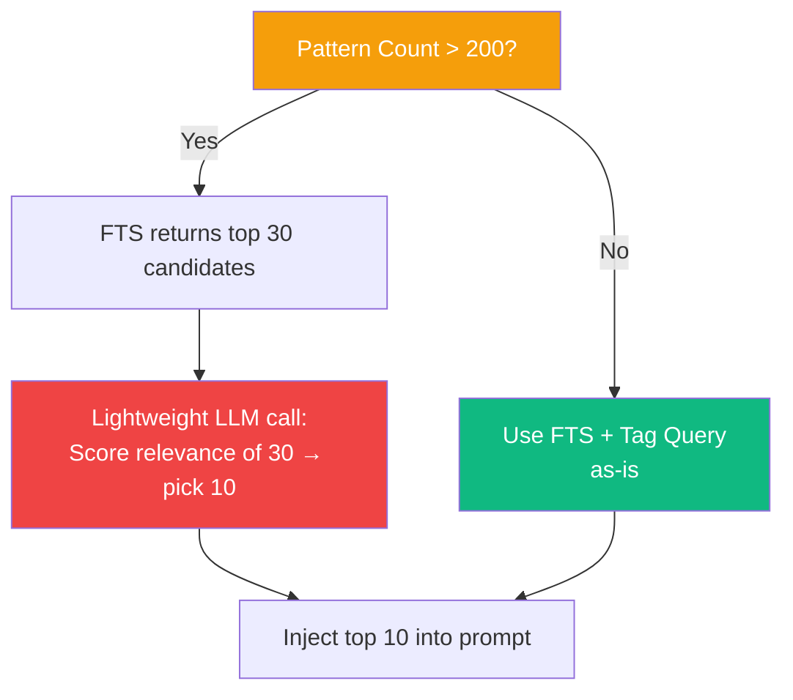

---

## 4. Project Intelligence Profile

### 4.1 Overview

The profile is a structured JSON document that synthesizes all decision patterns and knowledge
entries into a holistic project identity. It answers the question: "What is this project?"

- **Generated automatically** when the ratio of new patterns (since last generation) to total
  patterns exceeds 30%
- **Regenerable on demand** by the user at any time
- **Editable** — user can view and update any section directly
- **No approval gate** — auto-generated profiles are immediately active
- **Overwritten in place** — no version history (add later if needed)

### 4.2 Generation Trigger — Threshold-Based

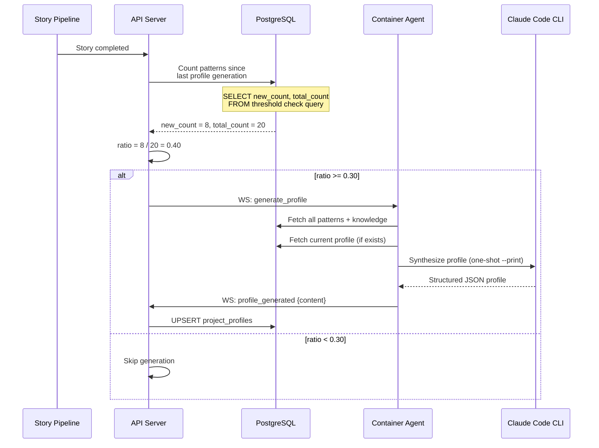

#### Trigger SQL

```sql
WITH profile_baseline AS (
    SELECT COALESCE(
        (SELECT generated_at FROM project_profiles
         WHERE project_id = $1 AND org_id = $2),
        '1970-01-01'::timestamptz
    ) AS last_generated
)
SELECT
    (SELECT COUNT(*) FROM decision_patterns
     WHERE project_id = $1 AND org_id = $2
       AND superseded_by IS NULL AND deleted_at IS NULL
       AND created_at > (SELECT last_generated FROM profile_baseline)
    ) AS new_count,
    (SELECT COUNT(*) FROM decision_patterns
     WHERE project_id = $1 AND org_id = $2
       AND superseded_by IS NULL AND deleted_at IS NULL
    ) AS total_count;
```

**Trigger condition:** `new_count::float / NULLIF(total_count, 0) >= 0.30`

**Edge cases:**

- `total_count = 0` → skip (no patterns to synthesize)
- First-ever generation → trigger when `total_count >= 3` (minimum viable profile)
- Manual trigger bypasses threshold check entirely

### 4.3 Profile Content — Structured JSON

```json
{
  "identity": "Developer tooling SaaS — AI-integrated development pipeline",

  "tech_stack": {
    "backend": "Rust / Axum / sqlx / PostgreSQL",
    "frontend": "React / Vite / Bun / shadcn / TanStack",
    "realtime": "WebSocket (server↔agent) + SSE (server→browser)",
    "infrastructure": "Kubernetes (k3s) / ArgoCD / Cloudflare",
    "ai": "Claude Code CLI subprocess"
  },

  "architectural_patterns": [
    "Actor model with tokio mpsc channels for agent concurrency",
    "Async event-driven processing for data pipelines",
    "Self-hosted container model — customer code never leaves their infra",
    "All LLM interaction through Claude Code CLI, never direct API"
  ],

  "conventions": [
    "UUIDv7 for all primary keys",
    "REST with flat URLs under /api/v1/",
    "Soft delete for audit trail integrity",
    "Multi-tenancy via org_id scoping with PostgreSQL RLS",
    "Card-based layouts for list views, tables for admin views"
  ],

  "team_preferences": [
    "Clean architecture over pragmatic shortcuts",
    "Type safety as a priority across all layers",
    "Never guess, always ask — AI pauses at decision points"
  ],

  "domain_knowledge": [
    "The Q&A pipeline uses multi-role perspectives (BA, Design, Dev, Security, Marketing)",
    "Stories own a single MR; tasks produce single commits",
    "Knowledge hierarchy: org-level → project-level → story-level"
  ]
}
```

#### Rust Types

```rust
#[derive(Debug, Clone, Serialize, Deserialize)]
pub struct ProjectProfileContent {
    pub identity: String,
    pub tech_stack: HashMap<String, String>,
    pub architectural_patterns: Vec<String>,
    pub conventions: Vec<String>,
    pub team_preferences: Vec<String>,
    pub domain_knowledge: Vec<String>,
}
```

### 4.4 Generation Pipeline

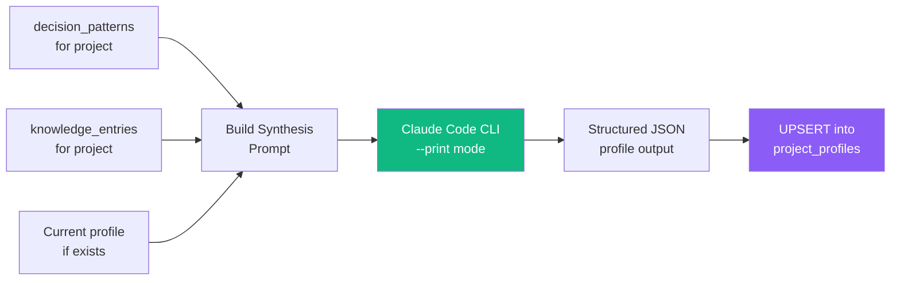

#### Synthesis Prompt

```
You are synthesizing a project intelligence profile from decision patterns
and knowledge entries. This profile will be injected into future AI prompts
to provide holistic project context.

## Decision Patterns (from past Q&A)
{patterns_json}

## Knowledge Entries (documented conventions)
{knowledge_entries}

## Current Profile (if any — update, don't start from scratch)
{current_profile_or_null}

Synthesize the above into a structured project profile. Merge overlapping
information. Resolve contradictions by favoring higher-confidence patterns
and more recent entries.

Respond ONLY with valid JSON matching this schema:
{
  "identity": "One sentence describing what this project is",
  "tech_stack": { "layer": "technologies" },
  "architectural_patterns": ["pattern 1", "pattern 2"],
  "conventions": ["convention 1", "convention 2"],
  "team_preferences": ["preference 1", "preference 2"],
  "domain_knowledge": ["insight 1", "insight 2"]
}

Rules:
- Each array item should be one concise sentence
- Deduplicate — no two items should say the same thing differently
- tech_stack keys should be logical layers (backend, frontend, database, etc.)
- If the current profile exists, preserve user edits where they don't
  conflict with newer patterns
```

### 4.5 Prompt Injection

The profile is injected into all prompt builders as a new section, positioned between the
knowledge base and the decision patterns:

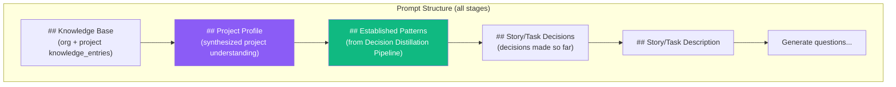

#### Injection Format

```
## Project Profile
This project's established identity and conventions:

**Identity:** Developer tooling SaaS — AI-integrated development pipeline

**Tech Stack:**
- Backend: Rust / Axum / sqlx / PostgreSQL
- Frontend: React / Vite / Bun / shadcn / TanStack
- Realtime: WebSocket (server↔agent) + SSE (server→browser)
- Infrastructure: Kubernetes (k3s) / ArgoCD / Cloudflare
- AI: Claude Code CLI subprocess

**Architectural Patterns:**
- Actor model with tokio mpsc channels for agent concurrency
- Async event-driven processing for data pipelines
- Self-hosted container model — customer code never leaves their infra

**Conventions:**
- UUIDv7 for all primary keys
- REST with flat URLs under /api/v1/
- Soft delete for audit trail integrity

**Team Preferences:**
- Clean architecture over pragmatic shortcuts
- Type safety as a priority across all layers

Treat these as established context. Do not re-ask decisions that align
with the profile unless the story explicitly conflicts.
```

#### Code Change — fetch_knowledge Extension

```rust
// In agents/service.rs — extend the existing knowledge fetch
pub async fn fetch_prompt_context(
    pool: &PgPool,
    org_id: Uuid,
    project_id: Uuid,
    story_description: &str,
) -> Result<PromptContext> {
    let knowledge = fetch_knowledge(pool, org_id, project_id).await?;
    let profile = fetch_project_profile(pool, org_id, project_id).await?;
    let patterns = fetch_relevant_patterns(pool, org_id, project_id, story_description).await?;

    Ok(PromptContext { knowledge, profile, patterns })
}
```

---

## 5. Data Model

### 5.1 Entity Relationship

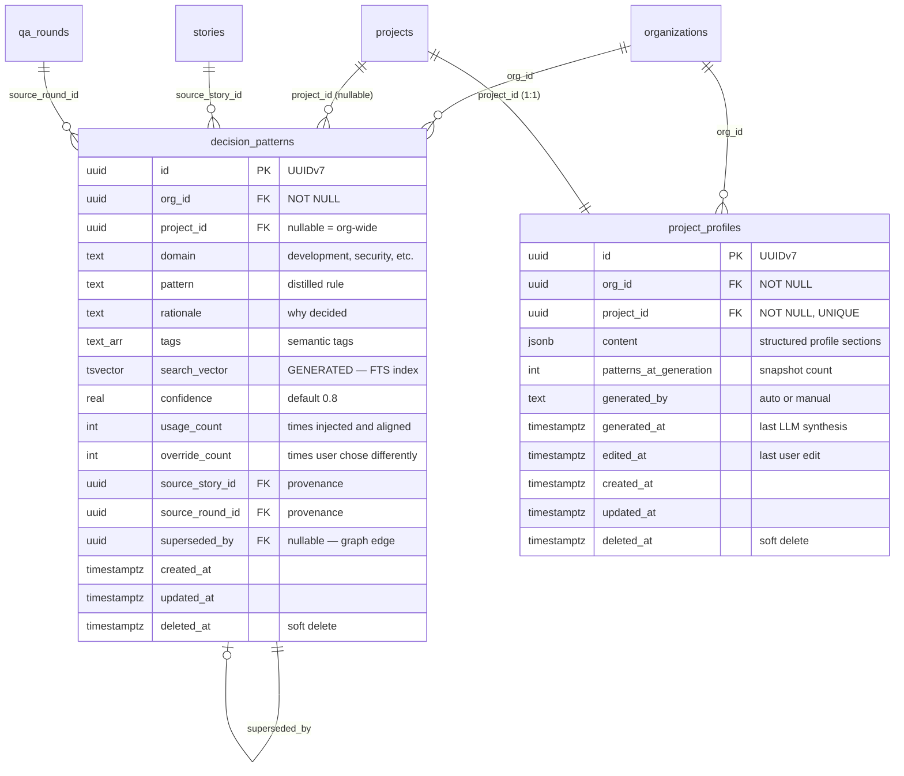

### 5.2 Indexes

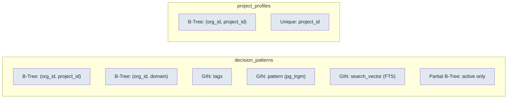

---

## 6. Migration SQL

```sql
-- ============================================================
-- Extension: pg_trgm for fuzzy text similarity
-- ============================================================
CREATE EXTENSION IF NOT EXISTS pg_trgm;

-- ============================================================
-- Table: decision_patterns
-- ============================================================
CREATE TABLE decision_patterns (
    id              UUID PRIMARY KEY DEFAULT gen_random_uuid(),
    org_id          UUID NOT NULL REFERENCES organizations(id),
    project_id      UUID REFERENCES projects(id),
    domain          TEXT NOT NULL,
    pattern         TEXT NOT NULL,
    rationale       TEXT NOT NULL,
    tags            TEXT[] NOT NULL DEFAULT '{}',
    confidence      REAL NOT NULL DEFAULT 0.8,
    usage_count     INT NOT NULL DEFAULT 0,
    override_count  INT NOT NULL DEFAULT 0,
    source_story_id UUID REFERENCES stories(id),
    source_round_id UUID REFERENCES qa_rounds(id),
    superseded_by   UUID REFERENCES decision_patterns(id),
    search_vector   TSVECTOR GENERATED ALWAYS AS (
        to_tsvector('english',
            pattern || ' ' || rationale || ' ' ||
            array_to_string(tags, ' ')
        )
    ) STORED,
    created_at      TIMESTAMPTZ NOT NULL DEFAULT now(),
    updated_at      TIMESTAMPTZ NOT NULL DEFAULT now(),
    deleted_at      TIMESTAMPTZ
);

CREATE INDEX idx_dp_org_project   ON decision_patterns(org_id, project_id);
CREATE INDEX idx_dp_domain        ON decision_patterns(org_id, domain);
CREATE INDEX idx_dp_tags          ON decision_patterns USING GIN(tags);
CREATE INDEX idx_dp_pattern_trgm  ON decision_patterns USING GIN(pattern gin_trgm_ops);
CREATE INDEX idx_dp_fts           ON decision_patterns USING GIN(search_vector);
CREATE INDEX idx_dp_active        ON decision_patterns(org_id, project_id)
    WHERE deleted_at IS NULL AND superseded_by IS NULL;

ALTER TABLE decision_patterns ENABLE ROW LEVEL SECURITY;
CREATE POLICY dp_org_isolation ON decision_patterns
    USING (org_id = current_setting('app.current_org_id')::uuid);

-- ============================================================
-- Table: project_profiles
-- ============================================================
CREATE TABLE project_profiles (
    id                      UUID PRIMARY KEY DEFAULT gen_random_uuid(),
    org_id                  UUID NOT NULL REFERENCES organizations(id),
    project_id              UUID NOT NULL REFERENCES projects(id),
    content                 JSONB NOT NULL DEFAULT '{}',
    patterns_at_generation  INT NOT NULL DEFAULT 0,
    generated_by            TEXT NOT NULL DEFAULT 'auto',
    generated_at            TIMESTAMPTZ,
    edited_at               TIMESTAMPTZ,
    created_at              TIMESTAMPTZ NOT NULL DEFAULT now(),
    updated_at              TIMESTAMPTZ NOT NULL DEFAULT now(),
    deleted_at              TIMESTAMPTZ,

    CONSTRAINT uq_profile_per_project UNIQUE (project_id)
);

CREATE INDEX idx_pp_org_project ON project_profiles(org_id, project_id);

ALTER TABLE project_profiles ENABLE ROW LEVEL SECURITY;
CREATE POLICY pp_org_isolation ON project_profiles
    USING (org_id = current_setting('app.current_org_id')::uuid);
```

---

## 7. API Endpoints

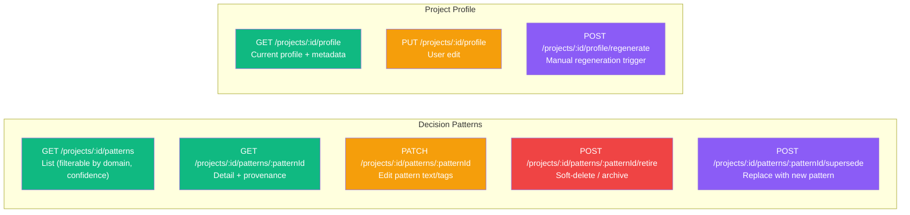

All endpoints scoped under `/api/v1/` and require org membership. Write operations (PATCH,
PUT, POST) require admin role.

| Endpoint | Method | Auth | Description |
|----------|--------|------|-------------|
| `/projects/:id/patterns` | GET | Member | List patterns, filterable by `domain`, `min_confidence` |
| `/projects/:id/patterns/:patternId` | GET | Member | Pattern detail with provenance (source story, round) |
| `/projects/:id/patterns/:patternId` | PATCH | Admin | Edit pattern text, rationale, or tags |
| `/projects/:id/patterns/:patternId/retire` | POST | Admin | Soft-delete (sets `deleted_at`) |
| `/projects/:id/patterns/:patternId/supersede` | POST | Admin | Creates new pattern, links via `superseded_by` |
| `/projects/:id/profile` | GET | Member | Current profile content + metadata |
| `/projects/:id/profile` | PUT | Admin | Update profile content (user manual edit) |
| `/projects/:id/profile/regenerate` | POST | Admin | Trigger immediate LLM regeneration |

---

## 8. UI Touchpoints

```mermaid
graph TB
    subgraph "Q&A View (existing — enhanced)"
        A[Question Block] --> B["Pattern Indicator Badge<br/>'Based on N project patterns'"]
        B --> C[Expandable: Show which<br/>patterns influenced this round]
        A --> D["Override Prompt<br/>'This pattern seems outdated —<br/>retire it?' after 2–3 overrides"]
    end

    subgraph "Knowledge Base — Patterns (new page)"
        E[Project Patterns Page] --> F[List: domain, pattern,<br/>confidence, usage count]
        F --> G[Actions: Edit / Retire /<br/>Supersede / View Provenance]
        F --> H[Filter by domain,<br/>confidence threshold]
        G --> I[Provenance Link:<br/>→ source story → source Q&A round]
    end

    subgraph "Knowledge Base — Profile (new page)"
        J[Project Profile Page] --> K[Last generated: timestamp<br/>Generated by: auto / manual]
        K --> L[Regenerate Button]
        M[Identity: editable text]
        N[Tech Stack: key-value pairs]
        O[Patterns / Conventions / Prefs:<br/>editable lists, add/remove/reorder]
        L --> P[Save Button]
        M --> P
        N --> P
        O --> P
    end

    subgraph "Story View (enhancement)"
        Q[Decision Trail] --> R[Patterns Applied indicator<br/>per Q&A round]
        R --> S[Inline diff: pattern default<br/>vs. actual user choice]
    end

    style B fill:#8b5cf6,color:#fff
    style D fill:#f59e0b,color:#fff
    style E fill:#4a9eff,color:#fff
    style J fill:#4a9eff,color:#fff
```

### Profile Page Behavior

- **View:** All sections displayed as readable, structured cards
- **Edit:** Inline editing per section — click to edit, save per section or save all
- **Regenerate:** Triggers LLM generation immediately (bypasses threshold check), overwrites
  current. Synthesis prompt includes current profile so the LLM preserves user edits where
  possible
- **Empty state:** "No profile yet — complete a few stories and the profile will be
  auto-generated, or click Regenerate to create one now"

---

## 9. End-to-End Flow

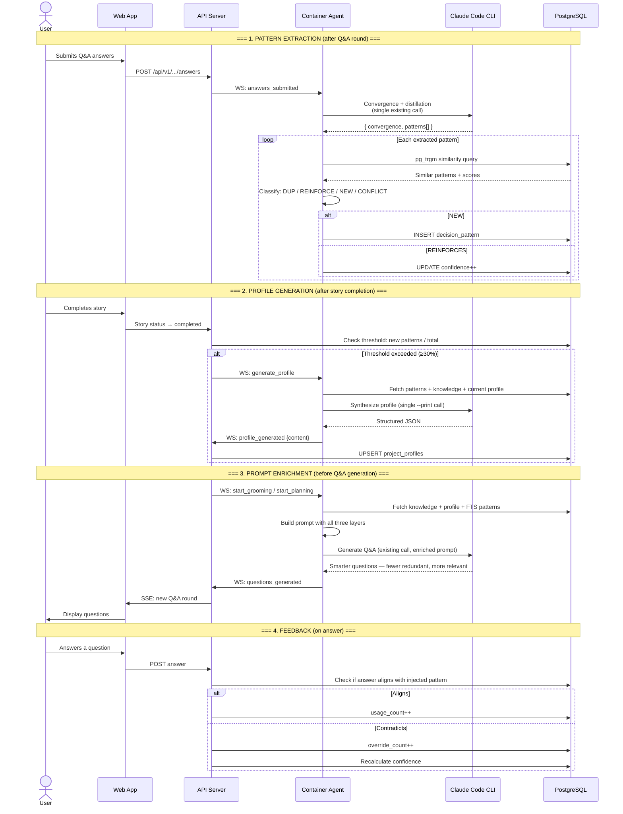

---

## 10. LLM Cost Summary

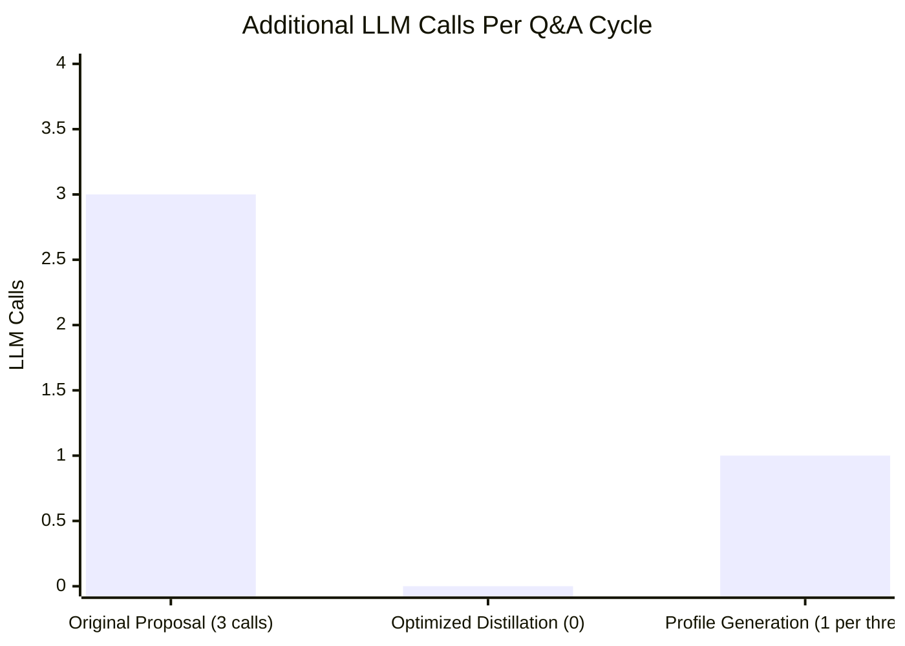

| Component | LLM Calls | When | Technique |
|-----------|:-:|---|---|
| Pattern distillation | +0 | Every Q&A round | Piggybacked on convergence call |
| Pattern dedup | +0 | Every pattern insert | pg_trgm + Jaccard (SQL only) |
| Pattern retrieval | +0 | Every Q&A generation | FTS + tag overlap (SQL only) |
| Profile synthesis | +1 | When new patterns ≥ 30% | One-shot Claude Code --print |
| Relevance scoring (Phase 5) | +1 | Only if 200+ patterns | Optional escape hatch |

**Hot-path cost: zero additional LLM calls.** Profile generation is off the critical path
(triggered on story completion, not during Q&A).

---

## 11. Implementation Phases

```mermaid
gantt
    title Cross-Story Intelligence — Implementation Phases
    dateFormat X
    axisFormat %s

    section P1 — Decision Patterns Foundation
    Migration: decision_patterns + project_profiles  :p1a, 0, 2
    Rust types: pattern + profile structs            :p1b, 0, 2
    Extend convergence prompt (piggyback)            :p1c, 1, 3
    pg_trgm dedup logic in Rust                      :p1d, 2, 4

    section P2 — Pattern Retrieval
    FTS search_vector column + index                 :p2a, 4, 5
    Retrieval query (fetch_relevant_patterns)        :p2b, 4, 6
    Inject patterns into prompt builders             :p2c, 5, 7

    section P3 — Profile Generation
    Threshold check in story completion handler      :p3a, 7, 8
    Profile synthesis prompt template                :p3b, 7, 9
    WS message types: generate / generated           :p3c, 8, 9
    UPSERT logic + fetch_project_profile             :p3d, 8, 9

    section P4 — Prompt Integration
    Unify fetch_prompt_context (knowledge+profile+patterns) :p4a, 9, 10
    Inject profile into all prompt builders                 :p4b, 9, 11
    Profile formatting for prompt injection                 :p4c, 10, 11

    section P5 — Feedback Loop
    Alignment detection on answer submit             :p5a, 11, 12
    Confidence recalculation logic                   :p5b, 11, 13
    Auto-archive at threshold                        :p5c, 12, 13

    section P6 — API + UI
    Pattern REST endpoints                           :p6a, 11, 13
    Profile REST endpoints                           :p6b, 11, 13
    Pattern management page                          :p6c, 13, 16
    Profile view/edit page                           :p6d, 13, 16
    Pattern indicator badge on Q&A view              :p6e, 14, 16
    Override / retire prompt UX                      :p6f, 15, 16

    section P7 — Optional
    LLM relevance scoring (if FTS insufficient)      :p7a, 16, 18
```

---

## 12. Key Design Decisions

| # | Decision | Choice | Rationale |
|---|----------|--------|-----------|
| 1 | Pattern distillation timing | Piggyback on convergence call | Zero extra LLM calls in Q&A hot path |
| 2 | Pattern dedup method | pg_trgm + Jaccard in SQL | No LLM overhead, ~30 lines Rust |
| 3 | Pattern retrieval method | PostgreSQL FTS + tag overlap | No vector DB dependency |
| 4 | Confidence model | Usage/override ratio formula | Simple, interpretable, auto-decaying |
| 5 | Pattern scope | Org-wide + project-level | Matches existing knowledge_entries hierarchy |
| 6 | Profile storage | Dedicated `project_profiles` table | Clean separation, type-safe, 1:1 with project |
| 7 | Profile content format | Structured JSON with sections | Programmatic access, diffable, editable per section |
| 8 | Profile versioning | Overwrite in place | Simple, no history bloat — add later if needed |
| 9 | Profile generation trigger | Threshold-based (30% new patterns) | Avoids wasteful LLM calls when nothing changed |
| 10 | Profile approval | None — fully automatic | Simpler UX; user edits when they want |
| 11 | Profile ↔ agent config | Independent | Profile is knowledge source only; manual config controls behavior |
| 12 | Profile user edits | Synthesis prompt includes current profile | LLM merges new patterns with user edits |
| 13 | Primary keys | UUIDv7 | Consistent with all existing tables |
| 14 | Deletion model | Soft delete (both tables) | Audit trail integrity |
| 15 | Multi-tenancy | org_id scoping + RLS (both tables) | Consistent with existing isolation model |
| 16 | LLM interaction | Claude Code CLI --print mode | No new subprocess patterns — same as Q&A generation |